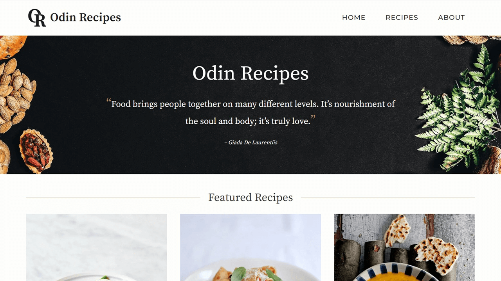

#  Odin Recipes

[Live Demo](https://thecolordude.github.io/odin-recipes/)

## Description

This is an assignment from the [Odin Project](https://www.theodinproject.com/paths/foundations/courses/foundations/lessons/recipes) to practice the fundamentals of HTML and CSS.

The purpose of this assignment is to build a simple HTML page that includes links to recipes. Each recipe has its own page with an image, description, ingredients etc. The pages should be properly structured, using the correct element types and then styled with CSS.

The data in this project may not be accurate and is duplicated throughout the pages. For more accurate information please check the sources listed below.

## Languages & Tools

The following were used for the creation of this project:

## Resources

*   Styling based on [jamieoliver.com](https://www.jamieoliver.com)
*   Text and recipe images from [jamieoliver.com](https://www.jamieoliver.com/recipes/)
*   Home page hero image from [unsplash.com](https://unsplash.com/photos/qYreP9QOdrk)
*   Home page quote from [sophisticatedgourmet.com](https://www.sophisticatedgourmet.com/food-quotes/)
*   Home page tip of the day from [goodhousekeeping.com](https://www.goodhousekeeping.com/food-recipes/cooking/tips/a19493/chef-cooking-tips/)
*   Icons from [fonts.google.com](https://fonts.google.com/icons)
*   Logo created in [Adobe Illustrator](https://www.adobe.com/gr_en/products/illustrator.html) using the Source Serif Pro font.
